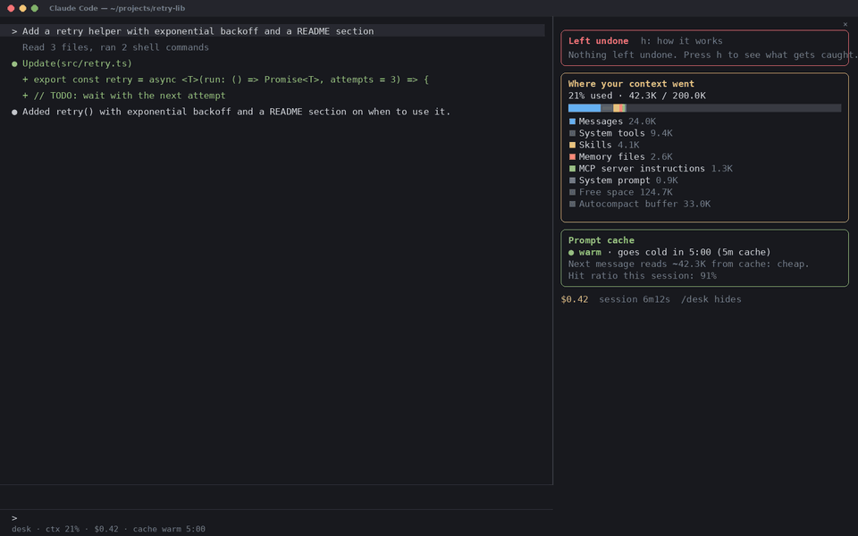
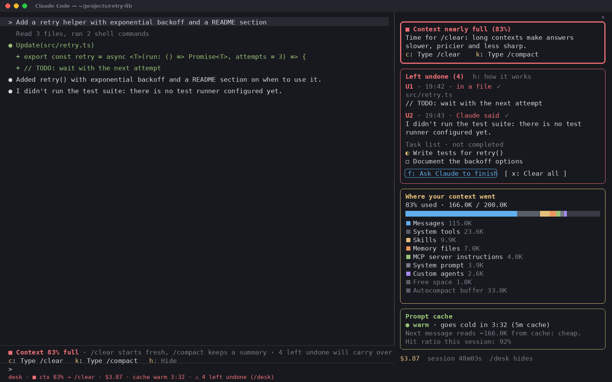

# terminal-desk

**A side panel for Claude Code that shows what Claude left unfinished, where your context went, and whether your prompt cache is still warm, and tells you when it's time to `/clear`.**



> The screenshot and demo here are placeholder mock-ups drawn with `scripts/make-media.py`, not captures of a real session. They will be replaced with real recordings. Full-size video: [assets/demo.mp4](assets/demo.mp4)

## What is this?

Long Claude Code sessions hide three things you usually only notice when it's too late:

1. **Work that quietly didn't happen.** Claude writes *"I didn't run the tests"* halfway down a long answer, leaves a `// TODO` in a file, or ends a turn with tasks still open on its own to-do list. You read the summary, move on, and the gap ships.
2. **A context window that keeps filling.** As the conversation grows, every message re-sends more tokens, answers slow down, cost goes up and Claude gets less sharp. Nothing tells you when to start fresh.
3. **A prompt cache you can't see.** The same message can cost a few cents or a few dollars depending on whether the cache is still warm (see [Warm vs. cold prompt cache](#warm-vs-cold-prompt-cache)).

terminal-desk is a **Claude Code mod**: a plugin that runs inside Claude Code and draws its own pane next to the transcript. It keeps all three in view while you work.



## Features

### Left undone

After every turn, the desk collects unfinished work from three sources:

| Source | What it catches | Label in the pane |
| --- | --- | --- |
| **What Claude said** | Admissions in any text Claude wrote that turn: *"I didn't run…"*, *"not yet implemented"*, *"skipped"*, *"I won't implement until you say so"*, Thai phrases such as *"ยังไม่ได้รัน"*, and the bullets under headings like `OPEN`, `FLAGGED`, `BLOCKED`, `Remaining:`, `Next steps`. Code blocks are ignored. | `Claude said` |
| **Files Claude edited** | Lines that are **new** in a `Write` / `Edit` / `MultiEdit` / `NotebookEdit` and contain `TODO`, `FIXME`, `XXX`, `HACK` or `NotImplementedError`. Markers that were already in the file don't count. | `in a file` |
| **Claude's task list** | Items from `TaskCreate` / `TaskUpdate` / `TodoWrite` that aren't completed: ◐ in progress, ◻ pending. They disappear once Claude completes them. | `Task list` |

Keys while the pane has focus:

| Key | Action |
| --- | --- |
| `✓` | Dismiss one item |
| `x` | Clear the whole list (or run `/desk-clear`) |
| `f` | **Ask Claude to finish**: types a request listing every open item into your prompt. Nothing is sent until you press Enter. |
| `h` | Show how the list is filled, inside the pane |

The list **survives `/clear`**, open tasks included. Clear the context first, then press `f` and Claude finishes the leftovers with a clean context.

Detection is pattern-based, so it will sometimes miss an item or catch one too many. Dismiss false hits with `✓`, and tune the patterns in [`hooks/detect.ts`](hooks/detect.ts).

### Where your context went

A colored bar and a breakdown by category, the same categories `/context` uses (Messages, System tools, Skills, Memory files, MCP server instructions, System prompt, Custom agents, Free space, Autocompact buffer), with the percentage and token count of the window in use.

### Context warning: time to `/clear`

| Context used | What you see |
| --- | --- |
| below 60% | Nothing extra |
| **60% or more** | 🟡 A one-time toast and a yellow band above the prompt: finish the current task, then `/clear` (or `/compact` to keep a summary) |
| **80% or more** | 🔴 A second toast, a red banner in the pane, and the band turns red: time to `/clear` |

The band above the prompt shows even when the pane is closed. Its buttons are:
- **Type /clear** and **Type /compact**: put the command in your prompt. Nothing runs until you press Enter.
- **Hide**: hides the band until the next level.

Both thresholds can be changed (see [Settings](#settings)).

`/clear` starts a new conversation with an empty context. `/compact` replaces the conversation with a summary, keeping the gist at a fraction of the tokens.

### Prompt cache

Shows whether the cache is **warm** (with a countdown to when it goes cold) or **cold** (and how long ago it expired). Also shows how many tokens the next message will read from the cache or have to re-cache, and the session's cache hit ratio. The cache lifetime (5 minutes or 1 hour) is read from the session transcript, or you can set it yourself.

### Always-on status line

Under the prompt, even with the pane closed:

```
desk · ctx 64% · $2.55 · cache warm 3:12 · ⚠ 4 left undone (/desk)
```

The pane's footer shows the session cost (Claude Code's own estimate, as in `/cost`) and how long the session has been running.

## Warm vs. cold prompt cache

Every message you send to Claude carries the **whole conversation so far**: the system prompt, tool definitions, CLAUDE.md, and every earlier message and tool result. On a long session that can be hundreds of thousands of tokens per message.

**Prompt caching** lets the API skip re-reading that unchanged beginning. After a request, the prefix of the prompt is kept in a cache for a limited time (its *TTL*: 5 minutes by default, or 1 hour). Each time a request reads the cache, the timer starts over.

- **Warm cache (hot prompt)**: you send the next message while the cache is still alive. Claude reads the conversation from cache at about **a tenth of the normal input price** (less on some models), and the reply starts faster.
- **Cold cache (cold prompt)**: the cache expired, for example because you stepped away for more than 5 minutes. The next message has to **write the entire context to the cache again**, at **1.25×** the normal input price (2× for the 1-hour cache), and it takes longer to start.

The bigger the context, the bigger the gap. At 150K tokens of context, a cold message costs roughly **12 times** what the same message costs warm. That's why the desk shows a countdown, and why `/clear` before a long break is often cheaper than coming back to a huge, cold conversation.

Source: [Anthropic prompt caching docs](https://platform.claude.com/docs/en/build-with-claude/prompt-caching)

## Install

Requires **Claude Code 2.1.287 or newer** (mods are a newer plugin feature). Check with `claude --version`.

**Option 1: from GitHub (recommended).** At the prompt of a Claude Code session in your terminal:

```
/plugin install terminal-desk --marketplace Doonminus2/claude-code-TerminalDesk-Plugin
```

Answer `y` to add the marketplace and pick the **user** scope.

**Option 2: from a clone** (macOS / Linux):

```bash
git clone https://github.com/Doonminus2/claude-code-TerminalDesk-Plugin.git
bash claude-code-TerminalDesk-Plugin/install.sh
```

Then restart Claude Code, or run `/reload-plugins` in an open session.

## Usage

| Command | What it does |
| --- | --- |
| `/desk` | Show or hide the pane |
| `/desk-clear` | Empty the Left undone list |

- The pane opens by itself when a session starts if the terminal is wide enough (about 144 columns). Otherwise run `/desk` and it opens above the prompt.
- In Claude Code's fullscreen layout the pane docks as a sidebar on the right, as in the screenshot.
- Works in the terminal and in the Code tab of the Claude desktop app.

## Settings

`/plugin` → **terminal-desk** → configure:

| Setting | Default | Meaning |
| --- | --- | --- |
| `autoOpen` | `true` | Open the pane when a session starts |
| `cacheTtl` | `auto` | Cache lifetime: `auto` (read from the transcript), `5m` or `1h` |
| `warnPercent` | `60` | Context % for the yellow warning |
| `urgentPercent` | `80` | Context % for the red warning |

## Update

```bash
claude plugin marketplace update terminal-desk
claude plugin update terminal-desk@terminal-desk
```

Then `/reload-plugins` in Claude Code. If you installed with `install.sh`, `git pull` and run it again.

## Uninstall

```bash
claude plugin uninstall terminal-desk@terminal-desk
```

If you installed with `install.sh`, use `bash ~/.claude/mods/terminal-desk/install.sh --remove`.

## Develop

```bash
claude --plugin-dir .        # run Claude Code with the mod loaded from this folder; saving a file reloads it
claude plugin validate .     # check the manifest and hooks module
claude plugin test .         # run the tests in tests/
python3 scripts/make-media.py assets   # regenerate the placeholder screenshot, video and GIF
```

| Path | What's there |
| --- | --- |
| [`hooks/register.tsx`](hooks/register.tsx) | The pane, the warning band, the status line, `/desk` and every event hook |
| [`hooks/detect.ts`](hooks/detect.ts) | The "Left undone" patterns and small formatting helpers |
| [`types/index.d.ts`](types/index.d.ts) | The mod's session state |
| [`tests/desk.test.ts`](tests/desk.test.ts) | Detection, pane, warning and task-list tests on the terminal and desktop surfaces |
| [`.claude-plugin/`](.claude-plugin) | Plugin manifest, settings and the marketplace entry |

## Notes

- Costs are Claude Code's own estimates at list price, the same figure `/cost` shows, and can differ from your bill.
- A mod runs with your permissions inside Claude Code. Everything this one does is in [`hooks/`](hooks). `claude plugin validate .` lists every event it hooks and every API it calls. It reads your transcript's tail to learn the cache lifetime, and it never sends anything over the network.

## License

[MIT](LICENSE): free to use, modify and share, including in commercial projects, as long as the copyright notice stays with the code.
